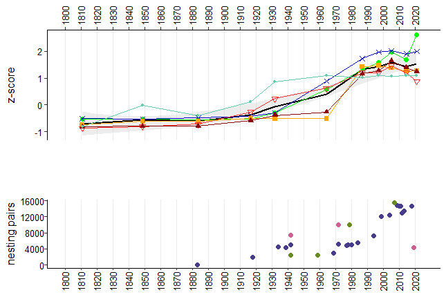
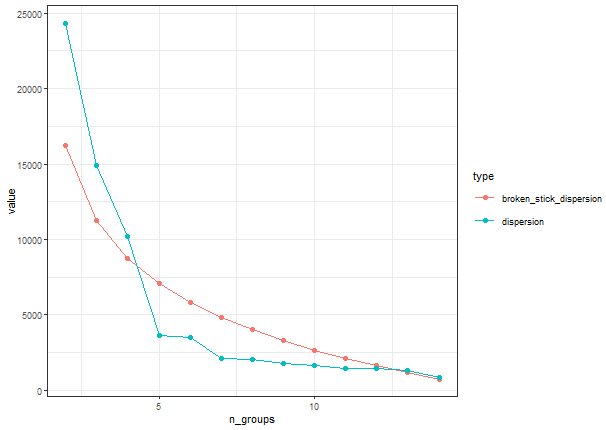
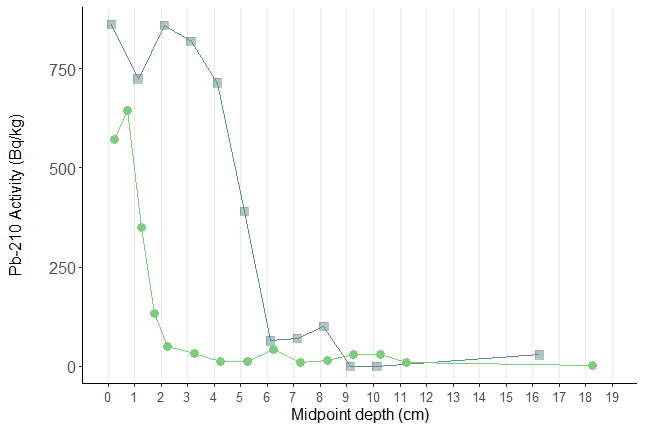
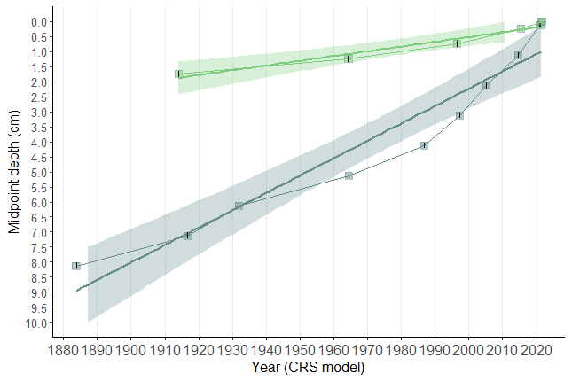
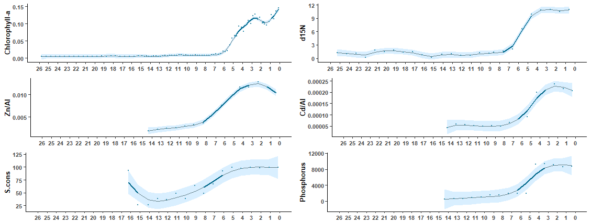
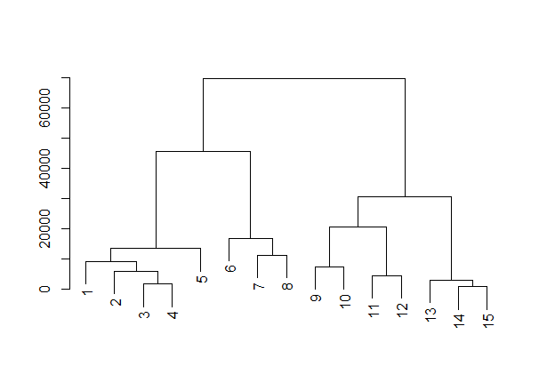
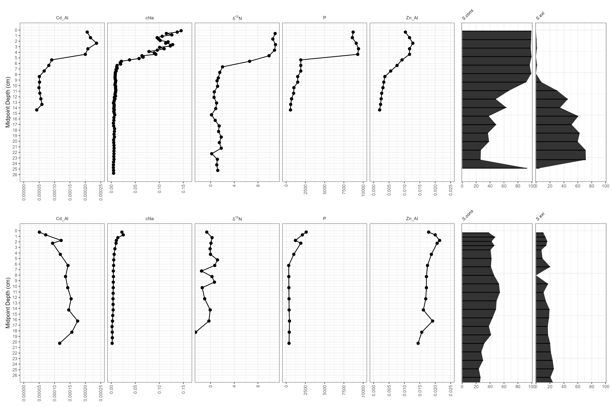

# **Paleoecological Analysis in R**

## Study overview

This is a public repo that can be used to learn how to conduct a paleoecological analysis in R.
The project methods described here are formally reviewed and cited in the following paper.

Please use this citation to cite this repository:

Bosch, JL., Álvarez-Manzaneda, I., Smol, J.P. et al. Blending census and paleolimnological data allows for tracking the establishment and growth of a major gannet colony over several centuries. Sci Rep 14, 20462 (2024). https://doi.org/10.1038/s41598-024-69860-z

    

## Accessing the data

A list of each of the data files from the `/data` folder and their contents:

| File name | Descriptions |
|----|---|
|`FileS1_ColonialSeabirdDatabase_WilhelmSI.csv`| Historical population reports collected for seabird species nesting in Cape St. Mary’s Ecological Reserve from 1883-2018. A blank cell indicates that population counts were not collected for that year. |
|`FileS2_MonitoringData.csv`|Raw monitoring data from File S1 used to align population data to the proxies.|
|`FileS3_Dating_CSM-IMP.csv` and `File S4_Dating_CSM-REF.csv`| Table containing 210Pb dating profiles over the depth of the impact core (CSM-IMP) and reference core (CSM-REF).|
|`FileS5_ProxyData_CSM-IMP.csv` and `FileS6_ProxyData_CSM-REF.csv`| Table containing the isotope, metal(loid), chlorophyll a, and diatom count data for the depths of the sediment core collected from the reference pond.|
|`File S7_Metalloids_CSM-IMP.csv` and `File S8_Metalloids_CSM-REF.csv`|Table of all metal(loid)s analyzed for the impact core and reference core.|
|`FileS9_ZScores_CSM-IMP.csv` | Z-score data for the isotope, metal(loid)s, chlorophyll a, and diatom count for the depths of the sediment core collected from the impact pond.|

## Scripts and Figures

Here is a list of all the scripts used in this analysis (see `/scripts`) and the final figures produced by each script.

  <h4>Proxy Alignment with Population Data</h4>
  
<em>Generated using: scripts/Z_score_analysis.R</em>

  

  
<em>Generated using: scripts/breakpoint_analysis_metals.R</em>

  <h4>Broken Stick Analysis for Metals</h4>
  
  

  <h4>Core Activity</h4>
  
<em>Generated using: scripts/dating_profiles.R</em>

  

  <h4>Core Age Model</h4>
  
<em>Generated using: scripts/dating_profiles.R</em>

  

  <h4>GAM Depth Plot</h4>
  
<em>Generated using: scripts/GAM_depth.R</em>

  

  <h4>Nested Metals Plot</h4>
  
<em>Generated using: scripts/breakpoint_analysis_metals.R</em>

  

  <h4>Paleostratigraphies</h4>
  
<em>Generated using: scripts/paleostratigraphies.R</em>

  

